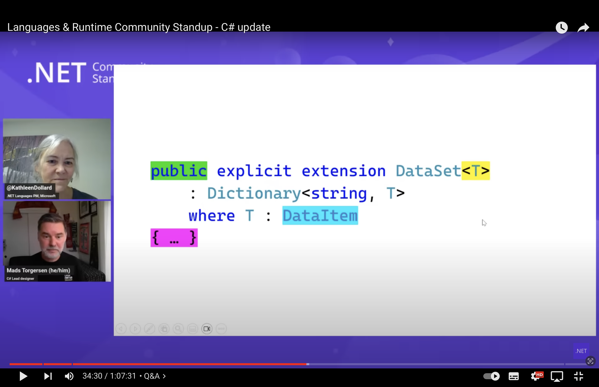
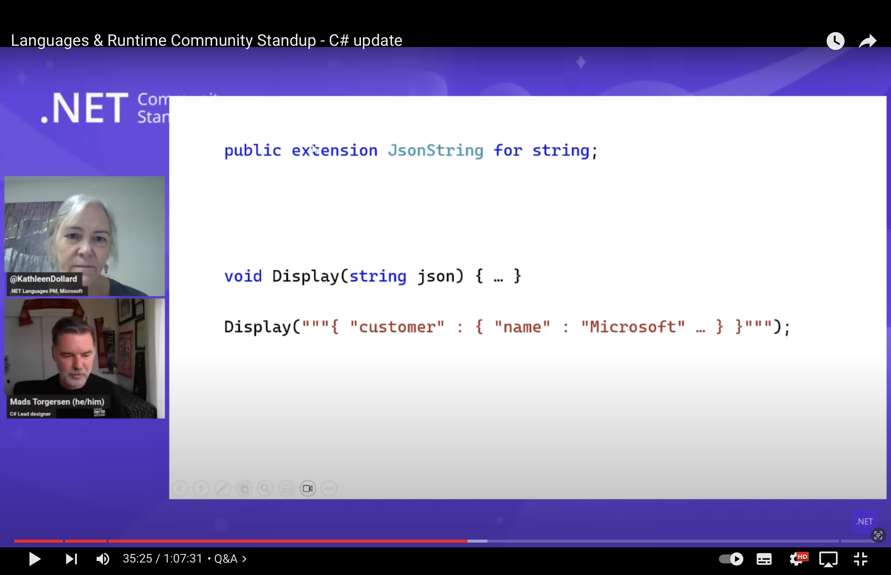
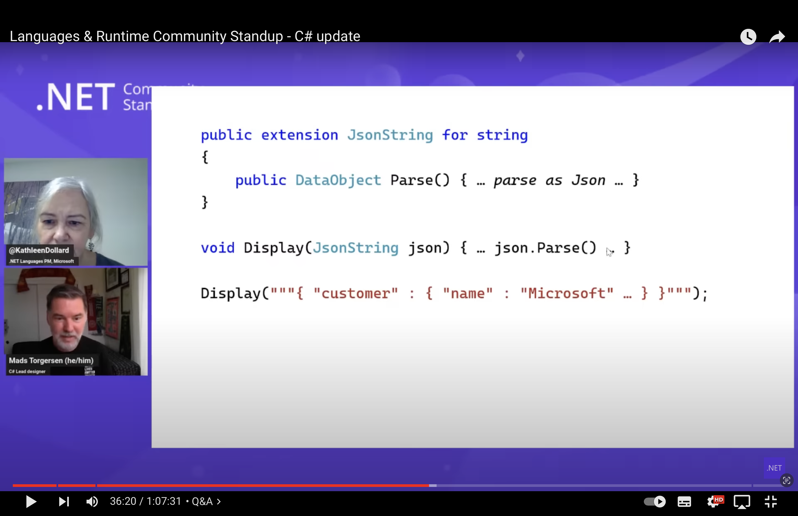
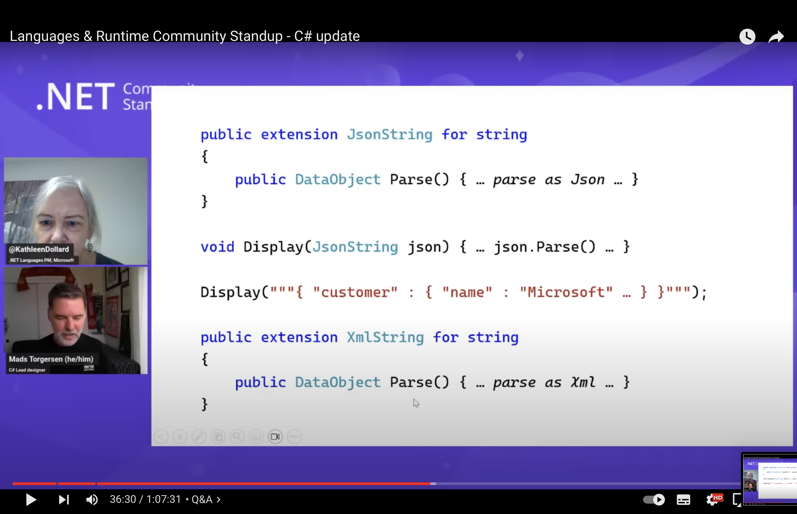
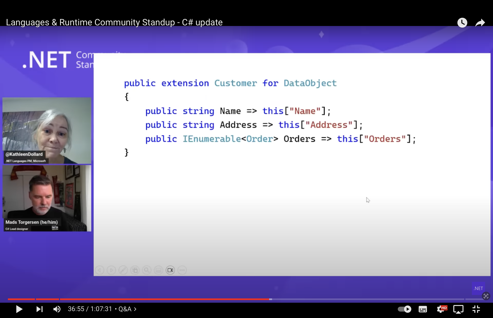
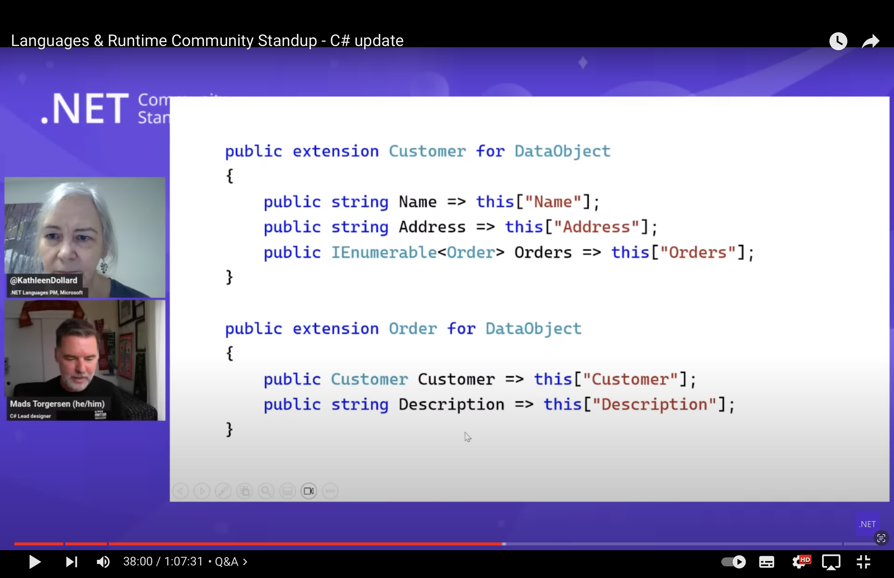
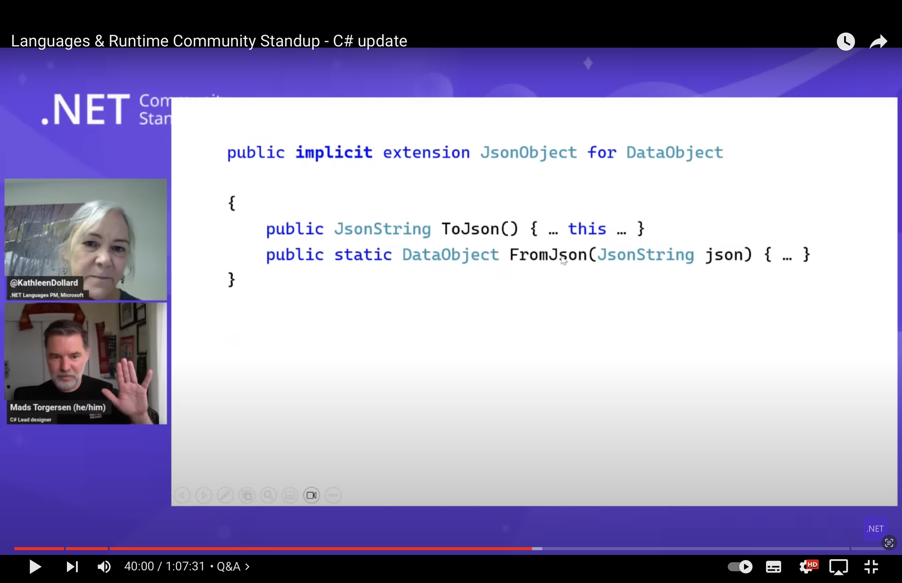
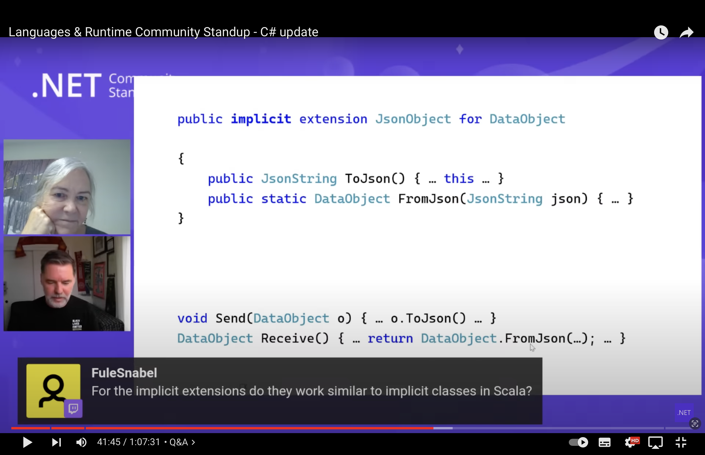
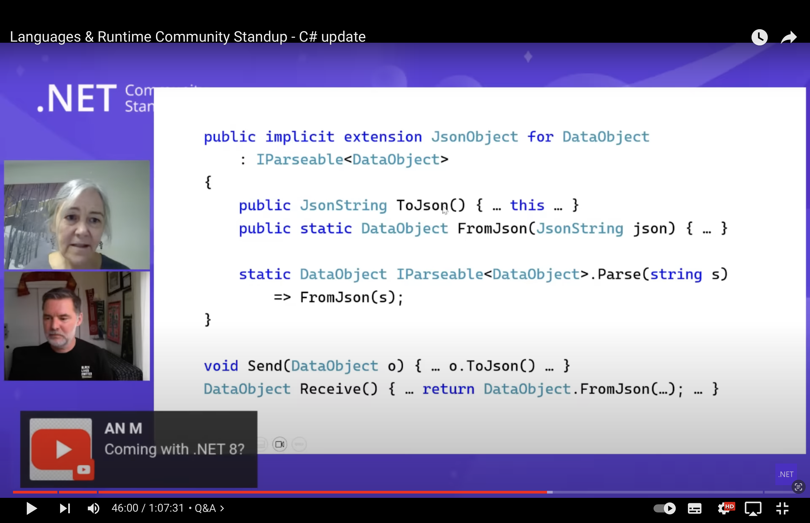

# MAYBE FUTURE C#13+

## `explicit/implicit extension`

[VIDEO](https://www.youtube.com/watch?v=rp1iX26T_LE) Mads & Kathleen talking about Future of C# 13+ aka **EXTENSION EVRYWHERE**

### DataObject **extension** -> _"wrapper"_ of generic `Dictionary<string, object>`

### JsonString **extension** of string -> method Parse (string = JSON)

### XmlString **extension** of string -> method Parse (string = XML)

### Customer, Order extension = **wrapper** -> DataObject _"Shape structural-tyoe ala TS"_

### `implicit extension` -> add Method to DataObject

#### Using method from `DataObject`

### Even **implementing Interface** from _"Outside"_

